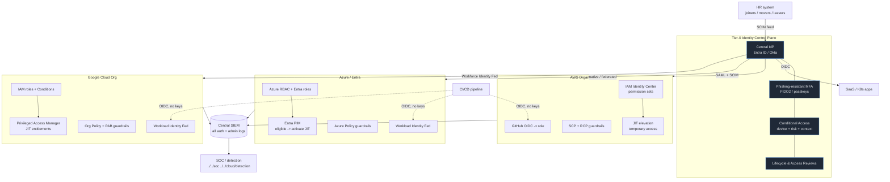

# Multi-Cloud IAM — Federation Diagram

Rendered by any Mermaid viewer (GitHub renders it inline).

## Reading it
- **Top-down trust:** one IdP (Tier-0) authenticates every human, with
  phishing-resistant MFA and Conditional Access, and drives lifecycle.
- **Federation, not duplication:** each cloud trusts the IdP; entitlements come
  from IdP groups.
- **JIT everywhere:** privileged use is activated on demand (Identity Center JIT
  / Entra PIM / GCP PAM), never standing.
- **Keyless workloads:** CI/CD and apps use OIDC/workload identity federation
  (dashed lines) — no static keys cross any boundary.
- **Guardrails per cloud** cap behavior regardless of grants.
- **All logs converge** to one SIEM for cross-cloud identity correlation.
