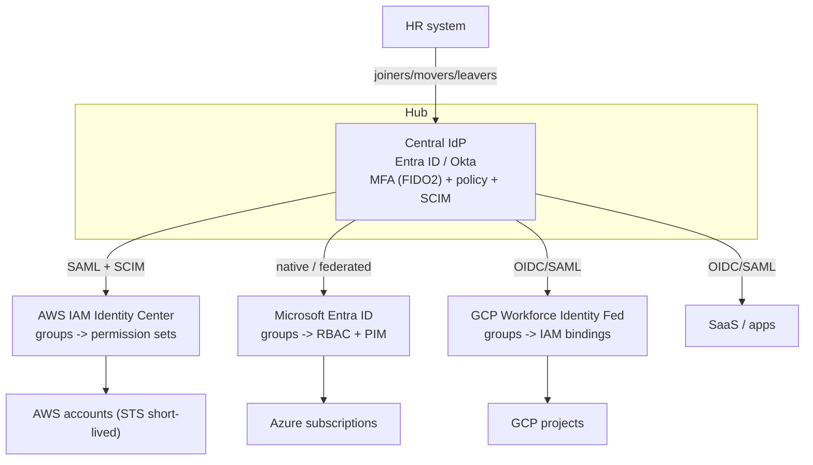
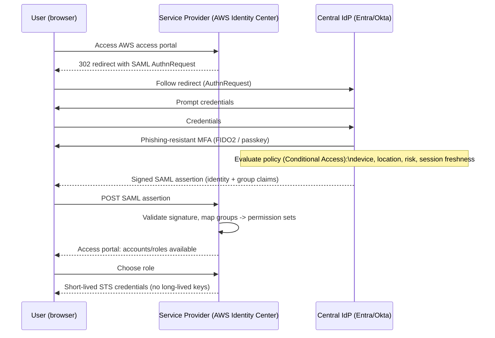
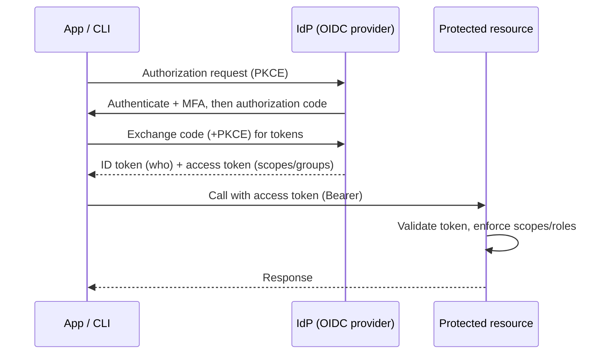
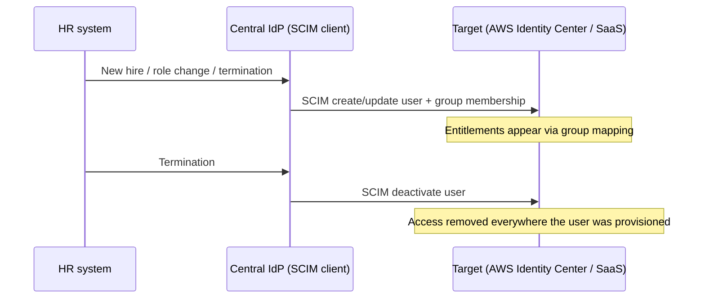

# SSO Diagrams

ASCII/Mermaid diagrams for the SSO flows. Paste the Mermaid blocks into any
Mermaid renderer (GitHub, VS Code, mermaid.live) for a rendered view.

---

## 1. High-level: one login, every cloud


---

## 2. SAML browser SSO — sign-in sequence (e.g. AWS Identity Center)


---

## 3. OIDC token flow (modern apps / workload)


---

## 4. SCIM provisioning / deprovisioning (lifecycle)


---

## 5. Multi-cloud federation (workload + human), text view
```
                         Central IdP (hub)
                         Entra ID / Okta
        ┌───────────────┬───────┴────────┬────────────────┐
   (human SAML/OIDC + SCIM)          (workload OIDC, keyless)
        ▼               ▼                ▼                ▼
   AWS Identity      Entra ID         GCP Workforce    CI/CD (GitHub)
     Center          native           Identity Fed     OIDC -> all 3
   perm sets        RBAC + PIM        IAM bindings     (no stored keys)
        │               │                │
        ▼               ▼                ▼
   AWS accounts    Azure subs        GCP projects
   + SCP/RCP       + Azure Policy    + Org Policy
```

See `../../zero-trust/architecture/diagram.md` for how the Policy Decision Point
wraps these sign-ins with device/network/session signals.
