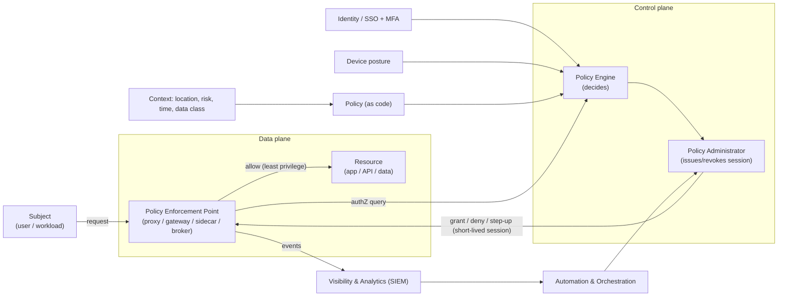
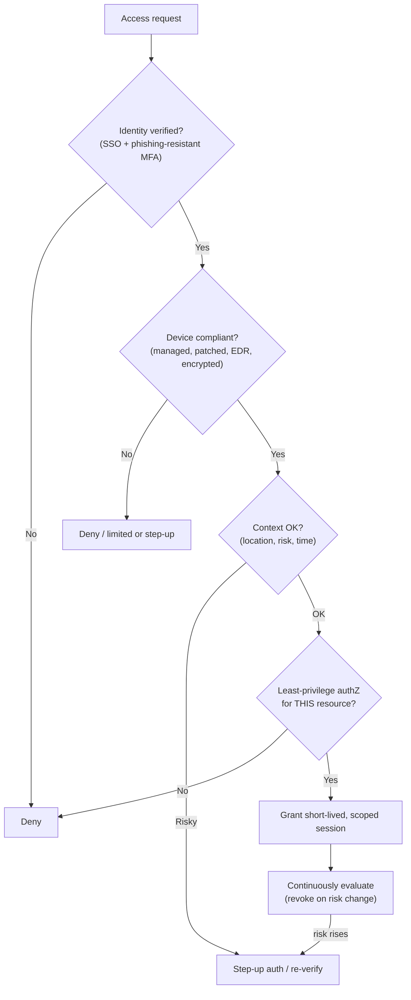
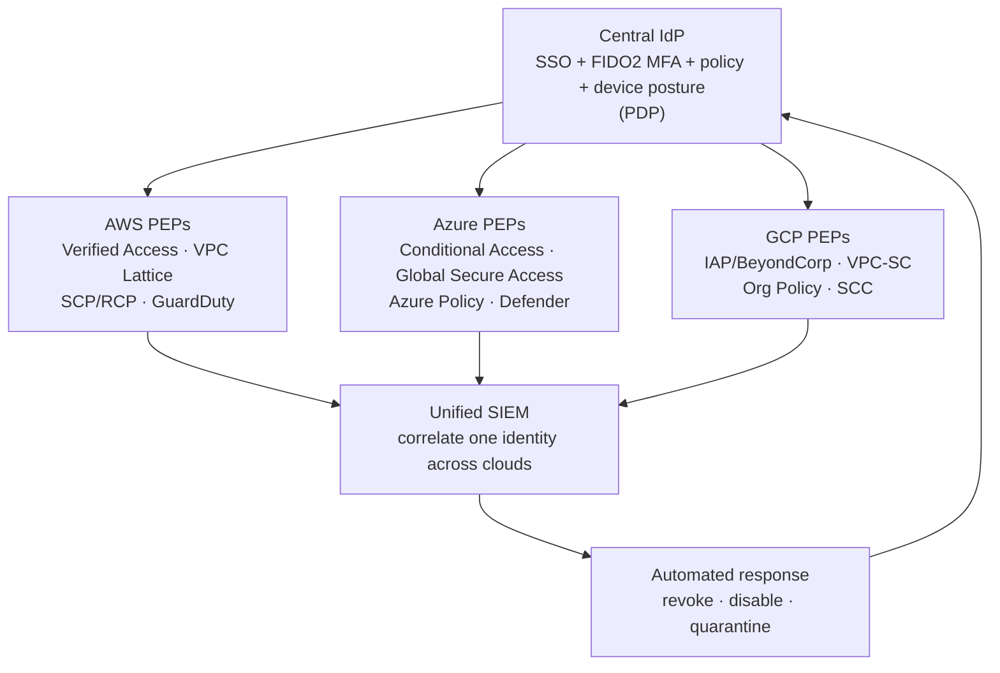

# Zero Trust Diagrams

ASCII + Mermaid diagrams. Paste Mermaid blocks into any Mermaid renderer
(GitHub, VS Code, mermaid.live).

---

## 1. NIST 800-207 core: PDP / PEP per-request decision


---

## 2. Per-request decision logic (what the PDP evaluates)


---

## 3. Pillar map (CISA ZTMM v2.0 + DoD)
```
   ┌──────────────────────── Cross-cutting ────────────────────────┐
   │  Visibility & Analytics  ·  Automation & Orchestration  ·  Governance │
   └───────────────────────────────────────────────────────────────┘
        ▲            ▲              ▲                ▲          ▲
   ┌─────────┐  ┌─────────┐  ┌──────────────┐  ┌───────────┐  ┌──────┐
   │Identity │  │ Devices │  │  Networks &  │  │Applications│  │ Data │
   │ (User)  │  │(Device) │  │ Environment  │  │& Workloads │  │      │
   └─────────┘  └─────────┘  └──────────────┘  └───────────┘  └──────┘
      SSO/IAM     Intune/EDR   segmentation      appsec/         classify
      MFA/JIT     posture      private access     workload id     encrypt/DLP
   (DoD pillar names in parentheses)
```

---

## 4. Multi-cloud: one PDP, three PEP planes


---

## 5. Maturity progression (per pillar)
```
 Traditional ──▶ Initial ──▶ Advanced ──▶ Optimal
 perimeter,      MFA rolling  centralized   fully automated,
 implicit trust  out, some    visibility,   dynamic per-request
 manual          automation   least priv    continuous verify
                 attribute    enforced      self-healing
                 policy        across pillars
        (target most orgs 2026: Advanced → Optimal, Identity first)
        (DoD: Target Level activities by 30 Sep 2027)
```
